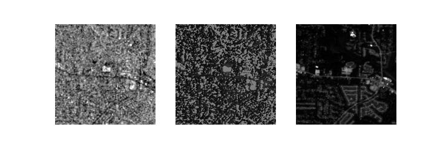
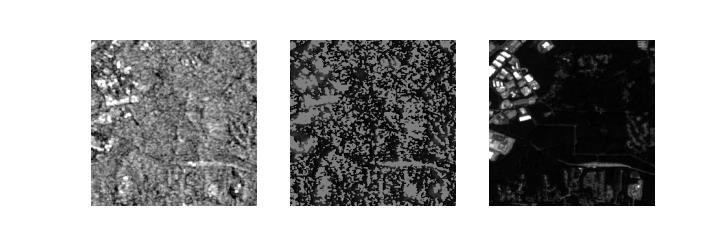
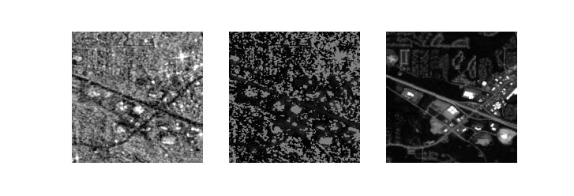
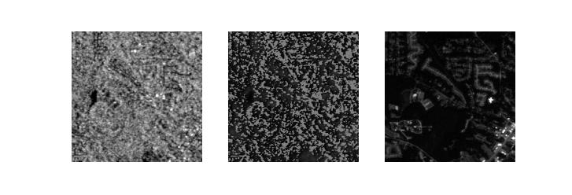

# SAR-Image-Despeckler (failed)
Despeckling of SAR images. 

CNN model was trained to despeckle SAR images, with grayscaled RGB images as ground truth. Although the distortion in SAR images is not speckling but it appears similar. The results however, were undesirable. 
The model, when applied to SAR images leads to a severe loss of information. The resultant images are extremely undesirable. This leads us to believe that perhaps the model should first be trained on grayscaled Sen-2 RGB images with additive Gaussian noise, or that the distortion and noise in SAR images cannot be treated the same as Gaussian noise. Further profiling and analysis is needed. 

 
 
 
 
